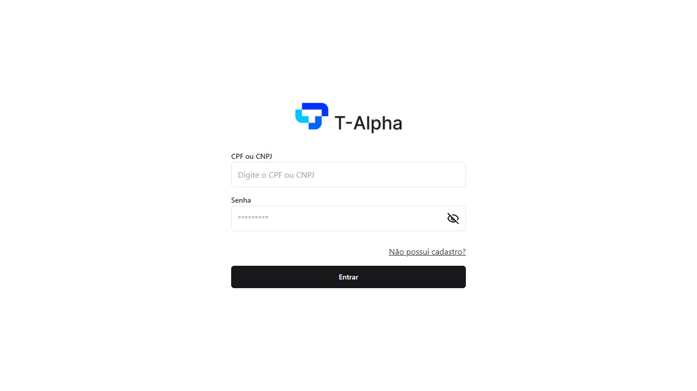
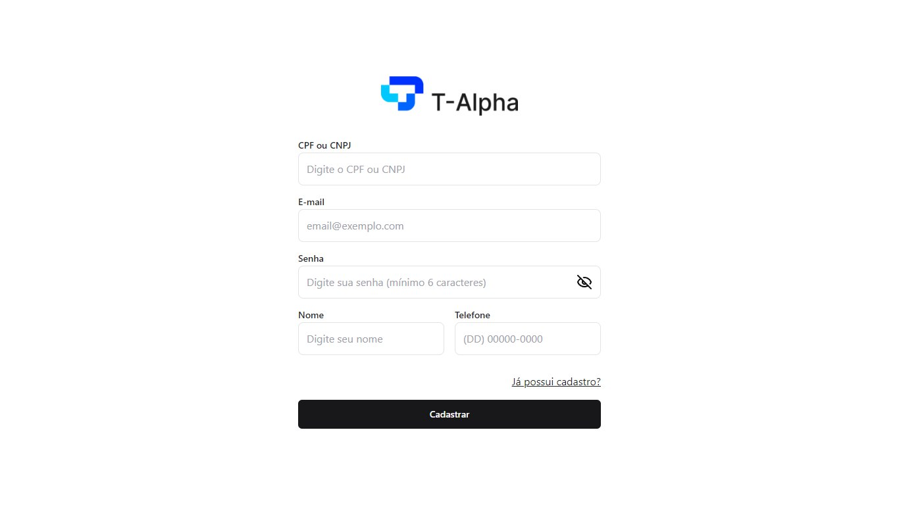
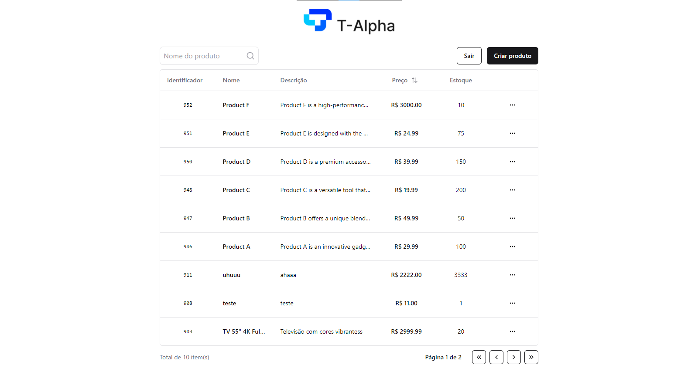

## T-ALPHA FRONTEND CHALLENGE

### 🤔 Sobre
O teste consiste no desenvolvimento de uma aplicação front-end, utilizando um dos seguintes frameworks: ReactJS, React Native ou Angular. O sistema deve conter autenticação e um CRUD (Create, Read, Update, Delete) de produtos. Para auxiliar no desenvolvimento, a aplicação foi integrada com a seguinte API de back-end: https://interview.t-alpha.com.br

A documentação da API pode ser encontrada pelo endereço https://interview.t-alpha.com.br/reference

### 🛠 Tecnologias/Ferramentas utilizadas

[react]
[typescript]
[tailwindcss]
[react-query]
[axios]
[react-hook-form]
[zod]
[shadcn-ui]
[eslint]


### 🚀 Como executar o projeto

```bash
# Clone o projeto
$ git clone https://github.com/MatheusGCM/t-alpha-challenge.git

# Entre na pasta
$ cd t-alpha-challenge

# Instale as dependências:
$ npm i

# Execute o app:
$ npm run dev
```
<br/>

### 💻 Preview

##### Login:


##### Cadastro:


##### Home:


[typescript]: https://www.typescriptlang.org/
[eslint]: https://eslint.org/
[react]: https://react.dev/
[tailwindcss]: https://tailwindcss.com/
[react-hook-form]: https://react-hook-form.com/
[zod]: https://zod.dev/
[react-query]: https://tanstack.com/query/v3
[axios]: https://axios-http.com/ptbr/
[shadcn-ui]: https://ui.shadcn.com/
